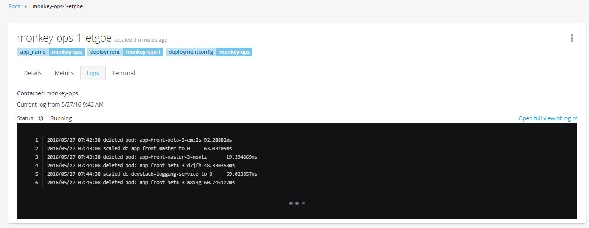

***

## What is Monkey-Ops

Monkey-Ops is a simple service implemented in Go which is deployed into a OpenShift V3.X and generates some chaos within it. Monkey-Ops seeks some Openshift components like Pods or DeploymentConfigs and randomly terminates them.

## Why Monkey-Ops

When you are implemented Cloud aware applications, these applications need to be designed so that they can tolerate the failure of services. Failures happen, and they inevitably happen when least desired, so the best way to prepare your application to fail is to test it in a chaos environment, and this is the target of Monkey-Ops.

Monkey-Ops is built to test the Openshift application's resilience, not to test the Openshift V3.X resilience.

## How to use Monkey-Ops

Monkey-Ops is prepared to running into a docker image. Monkey-Ops also includes an Openshift template in order to be deployed into a Openshift Project.

Monkey-Ops has two different modes of execution: background or rest.

* **Background**: With the Background mode, the service is running nonstop until you stop the container.
* **Rest**: With the Rest mode, you consume an api rest that allows you login in Openshift, choose a project, and execute the chaos for a certain time.

The service accept parameters as flags or environment variables. These are the input flags required:

      --API_SERVER string     API Server URL
      --INTERVAL float        Time interval between each actuation of operator monkey. It must be in seconds (by default 30)
      --MODE string           Execution mode: background or rest (by default "background")
      --PROJECT_NAME string   Project to get crazy
      --TOKEN string          Bearer token with edit grants to access to the Openshift project
      
### Usage with Docker

**Downloading the image**

	$ docker pull produban/monkey-ops:latest

**Running the image**

	$ docker run produban/monkey-ops /monkey-ops --TOKEN="Openshift Project service account token or Openshift user token" --PROJECT_NAME="Openshift Project name" --API_SERVER="Openshift API Server URL" --INTERVAL="Time interval between each actuation in seconds" --MODE=backgroun or rest"

### Usage with Openshift V3.x

Before all is necessary to create a service account (and a token as a secret) with editing permissions within the project that you want to use. The service account must be called with the same name than monkey-ops-template.yml parameter SA_NAME, by default monkey-ops.

In this page you can find how to do it: [Managing Service Accounts link](https://docs.openshift.com/enterprise/3.1/dev_guide/service_accounts.html#managing-service-accounts)

Simply you have to create a service account called monkey-ops:

	$ more monkey-ops.json
	{
	  "apiVersion": "v1",
	  "kind": "ServiceAccount",
	  "metadata": {
	    "name": "monkey-ops"
	  }
	}
	
	$ oc create -f monkey-ops.json
	serviceaccounts/monkey-ops
	
And later, grant it with edit role:

	$ oc policy add-role-to-user edit system:serviceaccount:"project name":monkey-ops

**Deploy *monkey-ops-template.yaml* into your Openshift Project:**

	$ oc create -f ./openshift/monkey-ops-template.yaml -n "Openshift Project name"
	
**Create new  application monkey-ops into your Openshift Project:**
	
	$ oc new-app --name=monkey-ops --template=monkey-ops --param=APP_NAME=monkey-ops,INTERVAL=30,MODE=background,TZ=Europe/Madrid --labels=app_name=monkey-ops -n <project_name>
	
Once you have monkey-ops running in your project, you can see what the service is doing in youy application logs. i.e.

**Time Zone**

By default this image uses the time zone "Europe/Madrid", if you want to change the default time zone, you should specify the environment variable TZ.

### API REST

Monkey-Ops Api Rest expose two endpoints:

* **/login**

>This endpoint allows a user to log into Openshift in order to get a token and  projects to which it belongs.

	
>**Request Input JSON:**

>{
>     "user": "User name",
>     "password": "User password",
>     "url": "Openshift API Server URL. e.g. https://ose.api.server:8443"
> }

>**Request Output JSON:**

>	{
>     "token": "Token",
>     "projects": {
>    	 "project1 name",
>    	 "project2 name",
>    	 .
>    	 .
>    	 .
>    	 "projectN name"
>    	 }
>}	 

	
* **/chaos**

>This endpoint allows a user to launch the monkey-ops agent for a certain time.

>**Request Input JSON:**

>	{
>     "token": "Token",
>     "url": "Openshift API Server URL. e.g. https://ose.api.server:8443",
>     "project": "Project name",
>     "interval": Time interval between each actuation in seconds,
>     "totalTime": Total Time of monkey-ops execution in seconds
>	}

